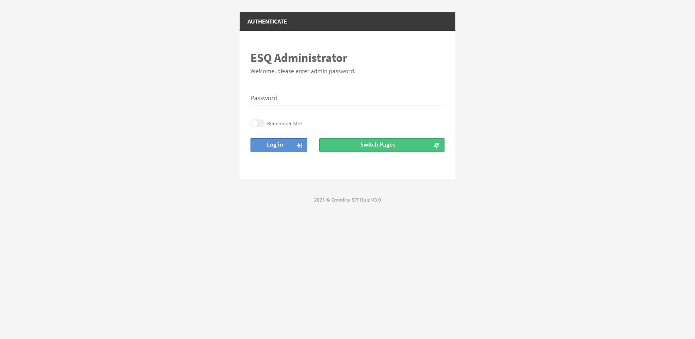
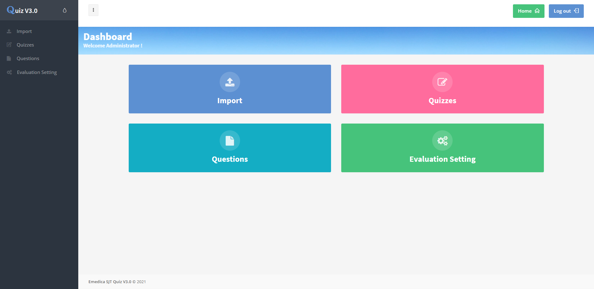
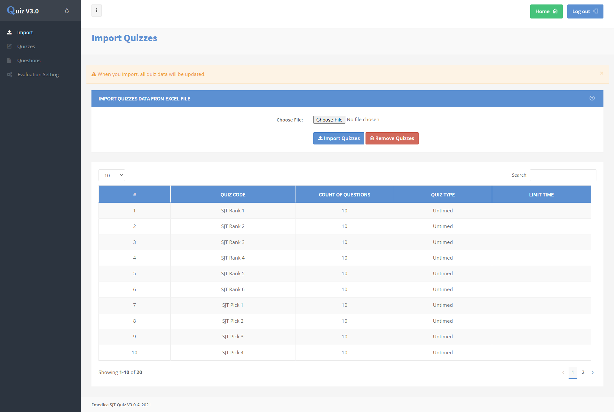
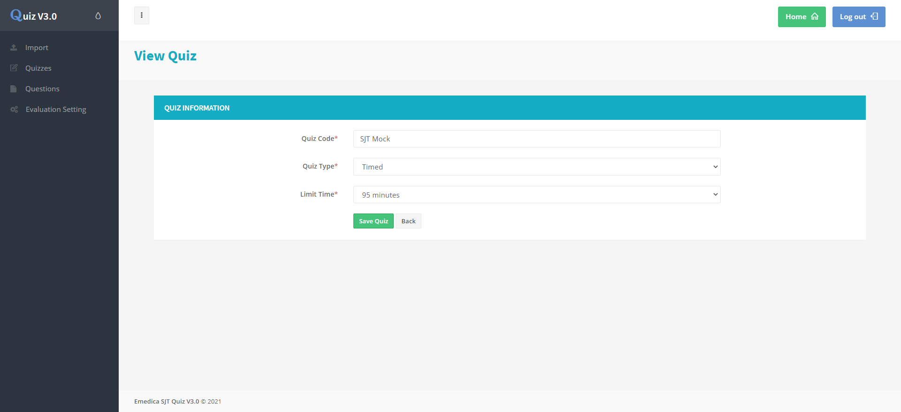
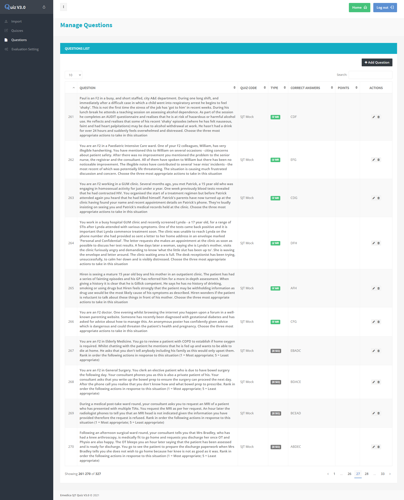
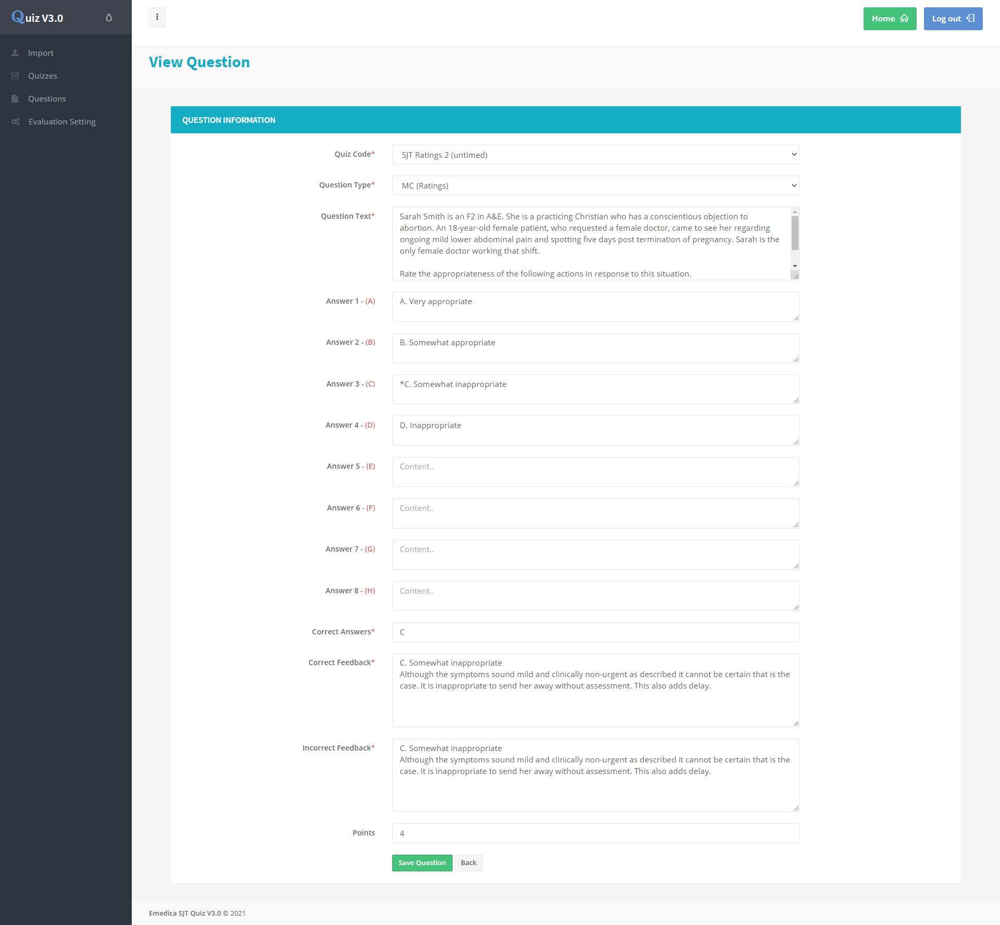
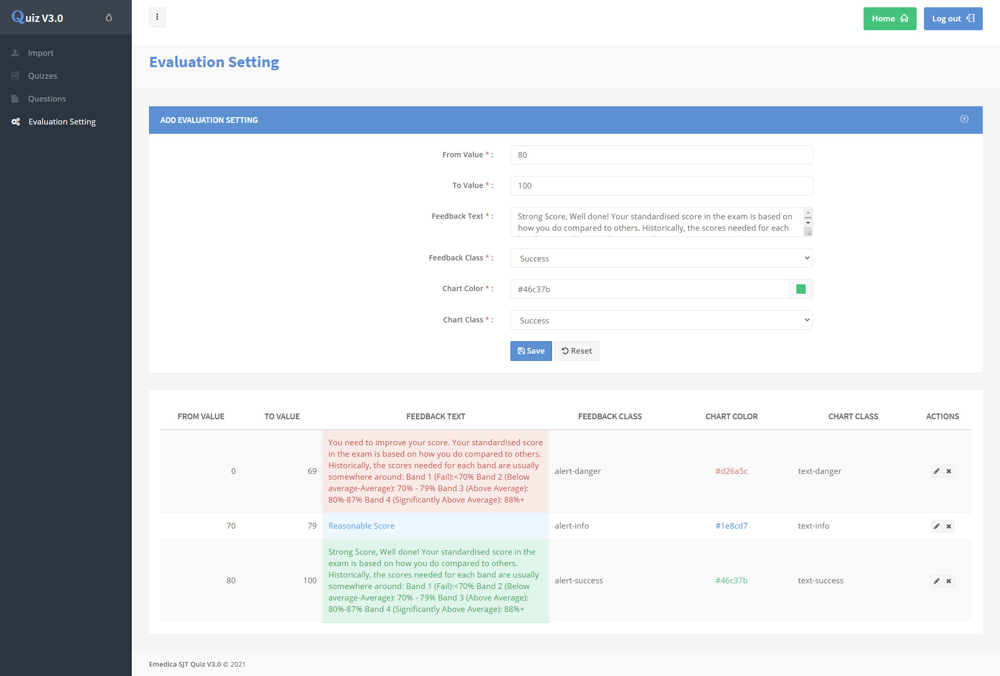

# Online Quiz Exam Web App

This project is for online exam with quizzes by using PHP/MySQL, HTML, CSS, Bootstrap v3.3.7, Responsive, JQuery and plugins, and Drag & Drop.

- Quiz Type: timed and untimed
- Question Type: SEQ(Ranking), MR(Selection), MC(Ratings)
- Quiz Kind: Ranking, Selection, Ratings, Minimock(combined with Ranking, Selection and Ratings, less than 50 questions), Mock(More than 50 questions)

Features:
[Admin]
- Log In

- Import quizzes & questions from excel file

- Manage quiz and question

- Evaluation Setting

[Student]
- Select quiz exam(Ranking, Selection, Ratings, Minimock, Mock)
- Load exam from saved
- Auto-save exam
- Drag & Drop(SEQ questions) and Multi-select(MR question), and Chice(MC question)
- Timeout exam(only timed quiz exam)
- Choose any question in progress exam
- Check answer in progress exam(only Ranking, Selection, Ratings quiz exam)
- Submit all answers and Evaluate exam
- Review your answers after evaluation